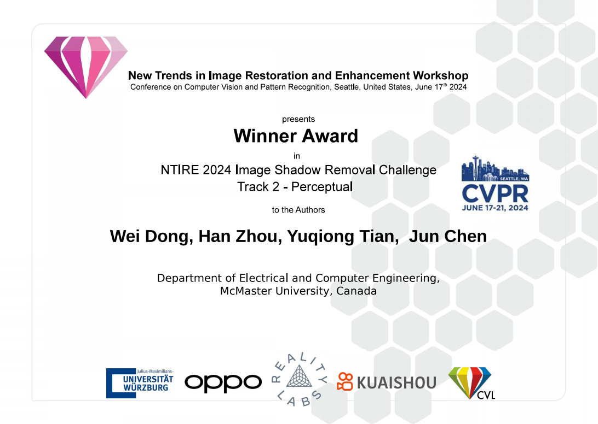
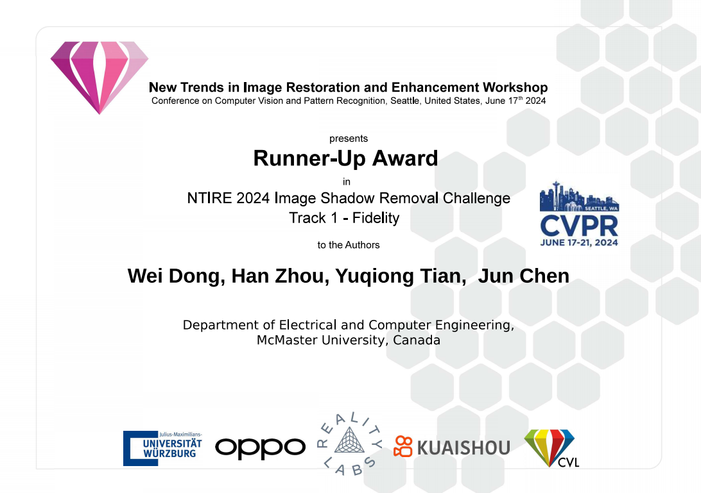
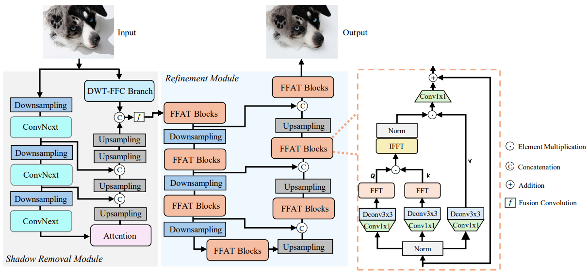

&nbsp;

<div align="center">
<p align="center">  </p>


[](https://arxiv.org/abs/2406.02559)
[](https://codalab.lisn.upsaclay.fr/competitions/17546#results)
[](https://codalab.lisn.upsaclay.fr/competitions/17539#results)

[](https://paperswithcode.com/sota/shadow-removal-on-adjusted-istd?p=shadowrefiner-towards-mask-free-shadow)
[](https://paperswithcode.com/sota/shadow-removal-on-istd?p=shadowrefiner-towards-mask-free-shadow)
[](https://paperswithcode.com/sota/shadow-removal-on-wsrd?p=shadowrefiner-towards-mask-free-shadow)


</div>
&nbsp;

### Introduction
This is the official PyTorch implementation of **ShadowRefiner: Towards Mask-free Shadow Removal via Fast Fourier Transformer** in CVPRW 2024. Our ShadowRefiner **won the first place** in the [NTIRE 2024 Challenge on Shadow Removal Perceptual Track](https://codalab.lisn.upsaclay.fr/competitions/17546) and **won the second place** in the [NTIRE 2024 Challenge on Shadow Removal Fidelity Track](https://codalab.lisn.upsaclay.fr/competitions/17539).  If you find this repo useful, please give it a star ⭐ and consider citing our paper in your research. Thank you.

### NTIRE 2024 Award
&nbsp;

<div align="center">
<p>  </p>
<p>  </p>
</div>
&nbsp;

### Overall Framework


### Results
<details close>
<summary><b>Performance on ISTD, ISTD+, and WSRD+:</b></summary>


</details>

<details close>
<summary><b>Performance on NTIRE 2024 Shadow Removal Challenge---Perceptual Track:</b></summary>


</details>

<details close>
<summary><b>Performance on NTIRE 2024 Shadow Removal Challenge---Fidelity Track:</b></summary>


</details>


### Create Environment
#### Dependencies and Installation
- Python 3.8
- Pytorch 1.11

1. Create Conda Environment
```
conda create --name shadowrefiner python=3.8
conda activate shadowrefiner
```

2. Install Dependencies
```
conda install pytorch=1.11 torchvision cudatoolkit=11.3 -c pytorch

pip install numpy matplotlib scikit-learn scikit-image opencv-python timm kornia einops pytorch_lightning
```
### Datasets
ISTD [Google Drive](https://drive.google.com/file/d/1I0qw-65KBA6np8vIZzO6oeiOvcDBttAY/view)

ISTD+ [Google Drive](https://drive.google.com/file/d/1rsCSWrotVnKFUqu9A_Nw9Uf-bJq_ryOv/view) 

WSRD+ [Train_input](https://drive.google.com/file/d/1n9l3UyQw6HjCXqycvHAfl4T-jsJpPHeJ/view), [Train_gt](https://drive.google.com/file/d/1DZEMIJ8PIxmZww8iAqlcvlKWyfssNQRO/view), [Validation_input](https://drive.google.com/file/d/1l2aertz2qKVLUkP-egwiCBcyf_5GWnav/view), [Validation_gt](https://drive.google.com/file/d/1a8JVs_zVQSdmxeDYJnqeEyynd9wV6n5D/view).

### Pre-trained Model
- [Our model for NTIRE 2024 Image Shadow Removal Challenge --- Fidelity Track & Perceptual Track](https://drive.google.com/file/d/1ntXl9vGVOFGel1-Pu1vbbWidOU3QH-IM/view?usp=sharing).


### Testing
Download above saved models and unzip it into the folder ./weights. To test the model, you need to specify the test dictionary (Line 15) and model path ( Line 34 and 41) in test.py. Then run
```bash
python test.py 
```
You can check the output in `../results`.


### Citation
If you find our work useful for your research, please consider citing our paper

```shell
@article{shadowrefiner_2024_cvprw,
    author    = {Dong, Wei and Zhou, Han and Tian, Yuqiong and Sun, Jingke and Liu, Xiaohong and Zhai, Guangtao and Chen, Jun},
    title     = {ShadowRefiner: Towards Mask-free Shadow Removal via Fast Fourier Transformer},
    journal   = {arXiv preprint arXiv:2406.02559},
}
```

### Contact
If you have any question, please feel free to contact us via wdong1745376@gmail.com.
